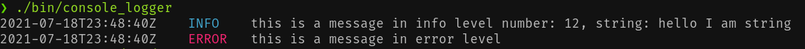
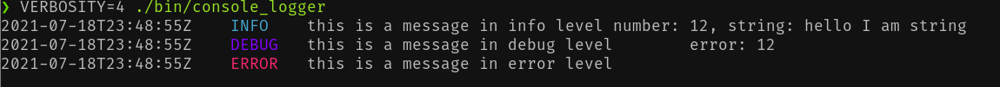
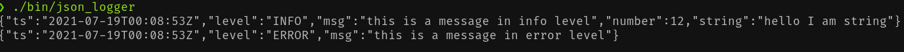
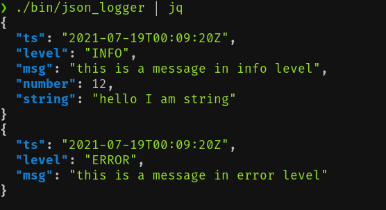
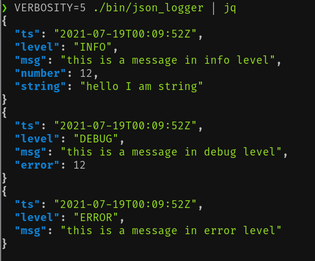

# PTCLogs library

PTCLogs is a library for pretty and configurable logs.

## Installation
To install the library (headers and .so file), clone this repo and run `make install`.

```
git clone http://github.com/ptcar2009/ptclogs
cd ptclogs
make install
```
## Usage

To compile the library, you need to link the library in compilation.
```
gcc -o main main.cpp -lptclogs
```

### Log level configuration
Log level can either be set via a parameter on instantiation or by a environment variable.

If set by an environment variable, you need to set the `VERBOSITY` environment variable to a number between 0 and 5, being 0 the lowes verbosity with only fatal logs and 5 the highest, containing debug logs.

If set by instantiation, it's a parameter in the `Logger` class.

## Console Logger

Console logger is for easily readable console logs with configurable log level sensitivity.
### Example
```cpp
#include <ptclogs/driver/console_driver.h>
#include <ptclogs/logs.h>

#include <string>

using namespace logger;
using logger::Field;
using std::string;
int main() {
   auto logger = Logger<ConsoleDriver>();
   logger.INFO("this is a message in info level", Field<int>("number", 12),
               Field<string>("string", "hello I am string"));

   logger.DEBUG("this is a message in debug level", Field<int>("error", 12));
   logger.ERROR("this is a message in error level");
}

```





## JSON logger
JSON logger encodes all information in machine readable JSON formatted objects.
### Example

```cpp
#include <ptclogs/driver/json_driver.h>
#include <ptclogs/logs.h>

#include <string>

using namespace logger;
using logger::Field;
using std::string;
int main() {
    auto logger = Logger<JSONDriver>();
    logger.INFO("this is a message in info level", Field<int>("number", 12),
		Field<string>("string", "hello I am string"));

    logger.DEBUG("this is a message in debug level", Field<int>("error", 12));
    logger.ERROR("this is a message in error level");
}

```




